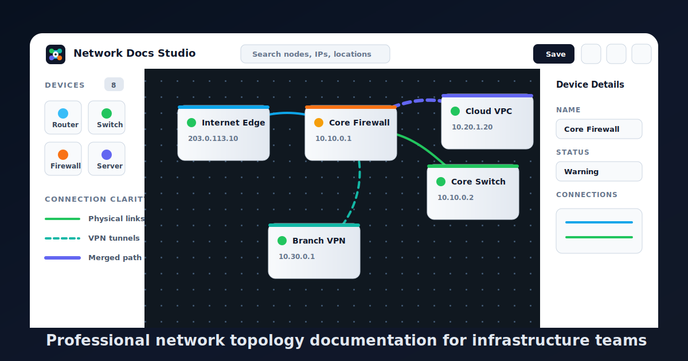

<p align="center">
  
</p>

# Network Docs Studio

Network Docs Studio is a modern web application for creating, editing, and sharing interactive network topology diagrams. It helps infrastructure and network teams document routers, switches, firewalls, servers, cloud services, VPN links, and physical or logical connections in a clean visual workspace.

## Features

- Interactive topology canvas with drag-and-drop nodes
- Device management with name, IP address, type, status, color, location, and notes
- Clear visual connections with labels, colors, arrows, dashed links, and media types
- Search, zoom, pan, minimap, grid snapping, undo, redo, and auto-align
- Multiple diagrams with save/load support
- Public/private sharing controls
- PNG, SVG, and printable PDF export
- Login and user management with `admin`, `editor`, and `viewer` roles
- Viewer users are read-only and cannot modify or delete diagram content
- Dark mode and collapsible side panels

## Tech Stack

### Frontend

- React 18
- TypeScript
- Vite
- TailwindCSS
- React Flow
- Framer Motion
- Zustand
- Lucide React icons

### Backend

- Node.js
- Express
- TypeScript
- Prisma
- SQLite
- JWT authentication
- Zod validation
- Helmet, CORS, compression, rate limiting, and Morgan logging

### Workspace

- npm workspaces
- Shared package for domain types and schemas
- Docker support for API and web services

## Project Structure

```text
apps/
  api/        Express API, Prisma schema, auth, users, diagrams
  web/        React frontend
packages/
  shared/     Shared TypeScript types and Zod schemas
docs/         Additional project documentation
```

## Requirements

- Node.js 20 or newer
- npm
- SQLite CLI, used by `npm run db:init --workspace @nds/api`

## Installation

Install dependencies from the repository root:

```bash
npm install
```

Create the API environment file:

```bash
cp apps/api/.env.example apps/api/.env
```

Generate Prisma client:

```bash
npm run prisma:generate --workspace @nds/api
```

Initialize the local SQLite database:

```bash
npm run db:init --workspace @nds/api
```

## Running Locally

Start the API:

```bash
npm run dev:api
```

The API runs on:

```text
http://localhost:4000
```

Start the web app in another terminal:

```bash
npm run dev
```

The web app runs on:

```text
http://localhost:5173
```

## Default Login

The API seeds an admin user automatically:

```text
Email: admin@qtbbank.com
Password: admin@123
```

Use this account to create additional users from the user management screen.

## Useful Commands

Type-check all packages:

```bash
npm run typecheck
```

Build all packages:

```bash
npm run build
```

Run only the frontend:

```bash
npm run dev
```

Run only the API:

```bash
npm run dev:api
```

Reset a user's password:

```bash
npm run build --workspace @nds/api
npm run user:reset-password --workspace @nds/api -- --email user@example.com --password newpass123
```

Inside the Docker API container, run the same command without rebuilding because the image already contains the compiled script:

```bash
npm run user:reset-password --workspace @nds/api -- --email user@example.com --password newpass123
```

## Docker

Build and run the app with Docker Compose:

```bash
docker compose up --build
```

Services:

- Web: `http://localhost:5173`
- API: `http://localhost:4000`

## Environment

API environment variables are defined in `apps/api/.env.example`:

```text
DATABASE_URL="file:./dev.db"
JWT_SECRET="change-me-in-production"
PORT=4000
CORS_ORIGIN="http://localhost:5173"
```

For production, replace `JWT_SECRET` with a strong secret and configure the correct frontend origin.

## Notes

- The development database is SQLite at `apps/api/prisma/dev.db`.
- Do not commit local `.env` files or SQLite database files.
- Diagram data is persisted through the API, not only in the browser.
